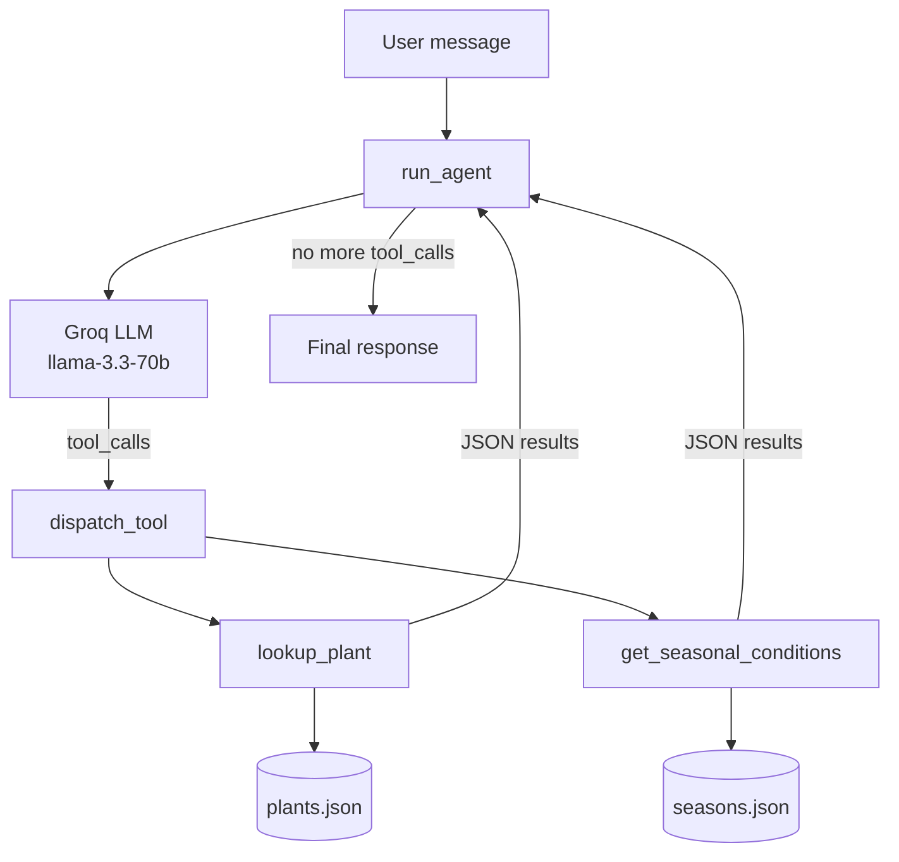

# Plant Advisor — Multi-Tool LLM Agent

A conversational agent that helps users care for houseplants by calling structured tools — looking up plant-specific requirements and checking seasonal care context — then synthesizing grounded advice from the results.

Built as part of CodePath AI201 (Week 2: Multi-Tool Agents).

---

## Why This Project Matters

Plant care pulls from **two logically separate data sources**: per-plant requirements (watering, light, humidity) and seasonal adjustments (winter dormancy, summer growth). A single RAG index would blur attribution. This project demonstrates the industry-standard alternative: a **tool-calling agent** where the LLM decides which data source to query and composes the answer from structured tool results.

**Skills demonstrated:** OpenAI-compatible function calling, agent loop design, tool schema authoring, structured JSON data retrieval, and production safety patterns (loop limits, graceful degradation).

---

## Architecture



| Component | File | Status |
|-----------|------|--------|
| Gradio chat UI | `app.py` | Complete |
| Tool schemas & dispatch | `agent.py` | Complete |
| Seasonal lookup tool | `tools.py` | Complete |
| Plant lookup tool | `tools.py` | In progress |
| Agent loop (`run_agent`) | `agent.py` | In progress |

---

## Tools

### `lookup_plant(plant_name)`

Searches a 15-plant database by common name, scientific name, or alias (e.g., "devil's ivy" → pothos). Returns structured care data: watering, light, humidity, temperature, fertilizing, and common issues.

**Matching strategy:** case-insensitive direct key match → display name match → alias match.

### `get_seasonal_conditions(season?)`

Returns seasonal care guidance from `seasons.json`. Auto-detects the current season from the calendar month when no season is specified.

---

## Key Technical Decisions

### Tool-calling over monolithic RAG

Plant-specific data and seasonal context have different query shapes. Separate tools keep retrieval precise and make it clear which source informed each piece of advice — the same pattern used in production agents (tools often deployed as independent services).

### Groq function calling (OpenAI-compatible)

The LLM returns structured `tool_calls` with function name and JSON arguments. Results are fed back as `role: "tool"` messages. This is the standard interface for tool-using agents across OpenAI, Groq, Anthropic, and others.

### `MAX_TOOL_ROUNDS` safety limit

The agent loop caps at 5 tool-calling iterations (`config.py`) to prevent runaway loops from buggy tools or unusual model behavior — a common production safeguard.

### Graceful degradation

When a plant isn't in the database (e.g., "string of pearls"), the agent should acknowledge the gap and offer general guidance based on what the user describes, rather than hallucinating care instructions.

---

## Data Sources

**`data/plants.json`** — 15 houseplants with display names, scientific names, aliases, difficulty, watering/light/humidity requirements, common issues, and per-season notes.

**`data/seasons.json`** — Spring, summer, fall, winter guidance on watering, fertilizing, light, repotting, pests, and general tips.

---

## Example Queries

| Question | Expected agent behavior |
|----------|-------------------------|
| "How do I care for my pothos?" | `lookup_plant("pothos")` → grounded care advice |
| "How often should I water my snake plant in winter?" | `lookup_plant` + `get_seasonal_conditions("winter")` → composed answer |
| "How do I care for my string of pearls?" | Plant not in DB → graceful degradation with general guidance |

---

## Run Locally

```bash
python -m venv .venv
source .venv/bin/activate          # Windows: .venv\Scripts\activate
pip install -r requirements.txt

cp .env.example .env               # add GROQ_API_KEY from console.groq.com
python app.py                      # opens Gradio UI in browser
```

The chat UI is fully functional. The agent returns responses once `lookup_plant()` and `run_agent()` are implemented (Milestones 1–2).

---

## Project Structure

```
Week-2/Lab-2/
├── app.py              # Gradio UI with plant sidebar & example questions
├── agent.py            # Tool definitions, dispatch_tool(), run_agent()
├── tools.py            # lookup_plant(), get_seasonal_conditions()
├── config.py           # API keys, MAX_TOOL_ROUNDS
├── data/
│   ├── plants.json     # 15-plant care database
│   └── seasons.json    # Seasonal care adjustments
└── specs/
    ├── system-design.md
    ├── tool-functions-spec.md
    └── agent-loop-spec.md
```

---

## Agent Loop Pattern

The `run_agent()` implementation follows the standard tool-calling cycle:

1. Build messages: system prompt + conversation history + new user message
2. Call LLM with `tools=TOOL_DEFINITIONS`
3. If response contains `tool_calls`:
   - Append the assistant message (with tool_calls) to messages
   - Execute each tool via `dispatch_tool()`, append results as `role: "tool"`
   - Call LLM again with updated messages
4. Repeat until no tool_calls or `MAX_TOOL_ROUNDS` reached
5. Return the final text response

See `specs/agent-loop-spec.md` for the full contract.

---

## What I'd Highlight on a Resume

- Designed a multi-tool agent architecture with separate data retrieval tools and an orchestration loop
- Implemented OpenAI-compatible function calling schemas and tool result dispatch
- Built structured JSON lookup tools with alias matching and auto-detected seasonal context
- Applied production patterns: loop safety limits, tool/UI separation, and graceful degradation for missing data
